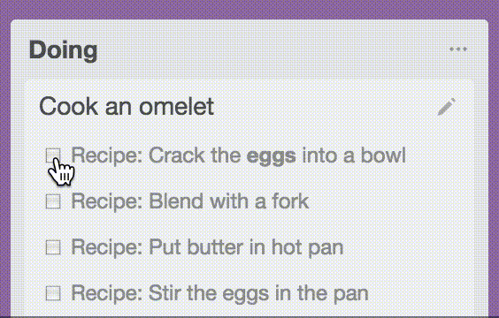

# Next Step for Trello [](https://standardjs.com) [](https://www.codacy.com/app/adrien-joly/chrome-next-step-for-trello?utm_source=github.com&amp;utm_medium=referral&amp;utm_content=adrienjoly/chrome-next-step-for-trello&amp;utm_campaign=Badge_Grade)

Browser extension to check tasks directly from your Trello boards. ☑️🚀

> Note: [The corresponding extension on Chrome Web Store](https://chrome.google.com/webstore/detail/next-step-for-trello-card/iajhmklhilkjgabejjemfbhmclgnmamf) was acquired on June 5th, 2023. It's now maintained by a different developer, in a different repository.

🌟 Install it from there: [Next Step for Trello](https://adrienjoly.com/chrome-next-step-for-trello/)



## Developers

📺🛠 You can watch on YouTube how I developed this Chrome Extension: [Livecoding Sessions](https://www.youtube.com/playlist?list=PLmzn1C-VN6G7FLdUJM3G82cG-Q69xJ2AY).

Note: Version number is bumped and the extension is published to Chrome Web Store automatically by `semantic-release`, run on CI after each commit on the `main` branch. Read `release.config.js` for more information.

## Contribute

This Chrome Extension is open source and free to use. It includes features and fixes proposed by several [contributors](https://github.com/adrienjoly/chrome-next-step-for-trello/graphs/contributors). Pull requests are welcome, especially on prioritized [bugs and feature requests](https://github.com/adrienjoly/chrome-next-step-for-trello/projects/1). Please don't forget to read [CONTRIBUTING.md](CONTRIBUTING.md) first.

[Donations](https://adrienjoly.com/donate) are not expected but always appreciated. 🤗

## Development workflow

### Setup the project locally

```sh
$ git clone https://github.com/adrienjoly/chrome-next-step-for-trello.git
$ cd chrome-next-step-for-trello
$ nvm use # switches to the version of Node.js specified in the .nvmrc file
$ npm install # installs development dependencies
$ npm run verify # checks for errors and code style inconsistencies
```

### Open the local version of the extension

1. In Chrome (or other Chromium-based web browser), open the following URL in a new tab: `chrome://extensions`
1. Enable the "developer mode"
1. If Next Step for Trello is already installed, disable it from that list
1. Click on "Load unpacked extension", then select the `chrome-next-step-for-trello` directory where you setup the project
1. Go to a Trello board, to make sure that the extension works
1. Otherwise, check the page's JavaScript console for errors
1. After every change, don't forget to click the "refresh" icon of the local extension, from `chrome://extensions`

### Release a new version on Chrome Web Store

This process is automated, as specified in `.github/workflows/ci.yml`.
